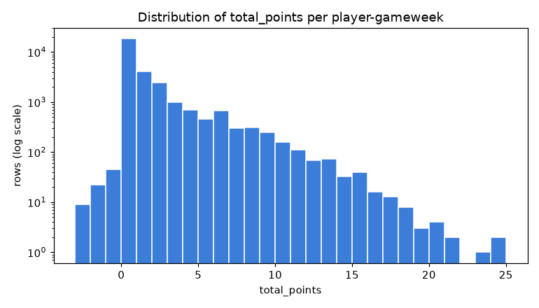
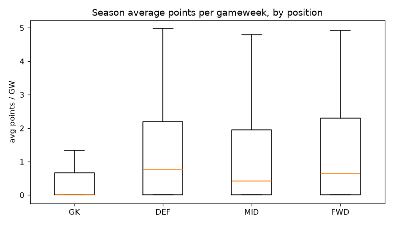
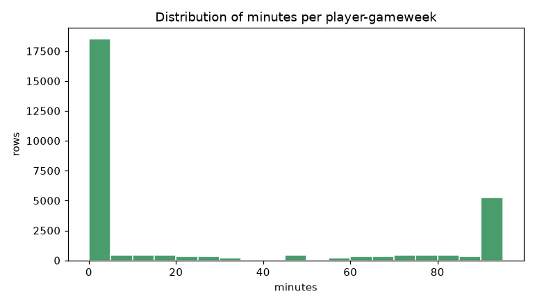
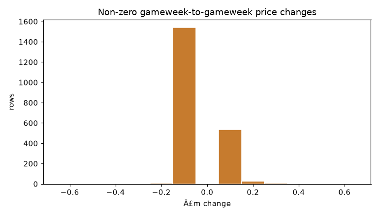
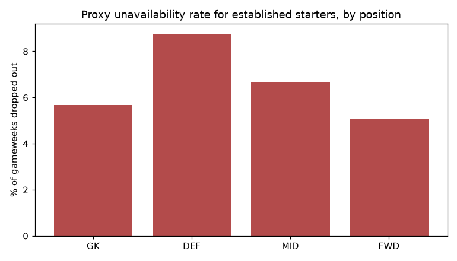

# EDA summary - Stats agent dataset

Source: `merged_gws_2025-26.csv` (vaastav/Fantasy-Premier-League), one row per player per fixture.

After collapsing double gameweeks: **29,338 player-gameweek rows**, **841 players**, gameweeks 1-38.

## 1. The target (`total_points`) is small, skewed and zero-heavy

- Mean **1.17** points per player-gameweek, median **0**, max **24**.
- **63% of rows are exactly 0** - mostly players who did not play.
- Among rows where the player actually got minutes, the mean is **3.03** (still skewed - a few hauls pull the tail).
- Points can be **negative** (min **-3**: yellow/red cards, own goals).

*Why it matters:* this is count-like, non-negative-ish, heavily zero-inflated data. A plain linear regression assuming a symmetric bell curve is a poor fit; a Poisson model (log link, variance grows with the mean) is closer to right, and tree models don't care about the shape at all. It also means **RMSE will be dominated by the rare big hauls** while MAE reflects the typical row - we report both.

## 2. Form (average points) differs by position

| position | players | mean avg-points | median | 90th pct |
|---|---|---|---|---|
| GK | 97 | 0.72 | 0.00 | 3.13 |
| DEF | 270 | 1.21 | 0.77 | 3.14 |
| MID | 379 | 1.12 | 0.42 | 3.27 |
| FWD | 95 | 1.27 | 0.65 | 3.35 |

*Reading it:* midfielders and forwards have the highest ceilings (attacking returns + the extra goal points for MID), goalkeepers are the most predictable (tight spread), defenders sit in between and are effectively two populations - a nailed-on starter in a good defence vs. a rotated one in a bad defence.

## 3. Minutes are bimodal - you either play ~90 or you don't play

- **61%** of rows are 0 minutes.
- **26%** of rows are 60+ minutes (the threshold for the 2-point appearance bonus).
- Only **12%** of rows are 'cameo' minutes (1-59).

*Why it matters:* predicting points is largely predicting *minutes* first. The middle ground barely exists, so a feature like recent start-rate should carry a lot of weight, and per-90 normalisation is needed so a good sub isn't buried by his low minute count.

| position | % rows 0 min | % rows 60+ min | mean minutes (all rows) |
|---|---|---|---|
| GK | 78% | 22% | 20.2 |
| DEF | 59% | 31% | 29.7 |
| MID | 60% | 25% | 24.3 |
| FWD | 56% | 23% | 23.5 |

## 4. Price changes are tiny, rare and mostly Ā£0.1 steps

- **93%** of gameweek-to-gameweek price moves are exactly Ā£0.0.
- When a price does move it is almost always **around Ā±Ā£0.1** (98% of non-zero moves).
- Season price range across players: Ā£3.7m - Ā£15.1m.
- Biggest single-GW rise **+Ā£0.3m**, biggest fall **Ā£-0.2m**.

*Why it matters:* raw price change per gameweek is a weak, sparse signal. It is more useful as **momentum** - the cumulative move over the last 3-5 gameweeks and its direction - which reflects what the crowd of managers thinks about a player's near-term prospects. That is how the price feature is engineered.

| position | mean season price | % GWs with a price move |
|---|---|---|
| GK | Ā£4.3m | 5% |
| DEF | Ā£4.4m | 7% |
| MID | Ā£5.3m | 8% |
| FWD | Ā£5.7m | 12% |

## 5. Injury / unavailability frequency (proxy)

This dataset has **no injury column**. In the live system the Injuries agent handles availability via team-news RAG. For EDA we use a behavioural proxy:

> A player is counted as **unavailable in gameweek N** if they played 60+ min in *both* gameweeks N-2 and N-1, then played **0 minutes** in N. That pattern - an established starter suddenly absent - is usually injury or suspension rather than a tactical call.

Across all established starters, **7.2%** of gameweeks see them drop out like this - so a nailed player has roughly a **1-in-14** chance of missing any given gameweek.

| position | established-starter GWs | unavailable next GW | rate |
|---|---|---|---|
| GK | 653 | 37 | 5.7% |
| DEF | 2,261 | 198 | 8.8% |
| MID | 2,335 | 156 | 6.7% |
| FWD | 532 | 27 | 5.1% |

*Reading it:* **DEFs** drop out most often (8.8%), consistent with forwards and centre-backs carrying more knocks. The practical takeaway for the model: recent minutes and start-rate are not just 'form', they are also an **availability estimate** - and the Manager still gets a hard veto from the News agent on top of whatever this model predicts.

## 6. What already correlates with next-gameweek points?

Pearson correlation of a single past-gameweek stat with the *following* gameweek's points (rough guide, not the model):

| stat (gameweek N) | corr with points in N+1 |
|---|---|
| last GW minutes | 0.54 |
| last GW ict_index | 0.44 |
| last GW bps | 0.41 |
| last GW points | 0.40 |
| last GW xGI | 0.32 |
| price | 0.29 |

*Reading it:* recent minutes (~0.5) and ICT (~0.45) carry the most single-signal information; last gameweek's points on its own is ~0.4. Nothing reaches 0.6. This is why the model needs many weak features combined, and why beating a naive rolling-average baseline by a wide margin is unlikely - points are genuinely noisy week to week.

## Headline takeaways for modelling

1. **Predict minutes before points.** ~61% of rows are zeros; recent minutes and start-rate are the highest-value features.
2. **Use MAE as the primary metric, RMSE as secondary.** RMSE is hostage to a handful of 15+ point hauls.
3. **Poisson over plain linear.** The target is skewed, zero-inflated and (mostly) non-negative count data.
4. **Expect a modest beat over the naive baseline.** The best single stat (recent minutes) correlates ~0.5 with next-GW points; last-GW points alone ~0.4.
5. **Availability is a feature, not just an agent concern** - but the News agent still holds the hard veto.
