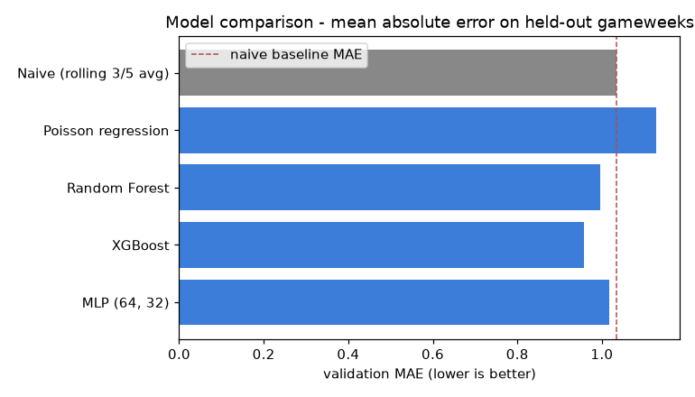
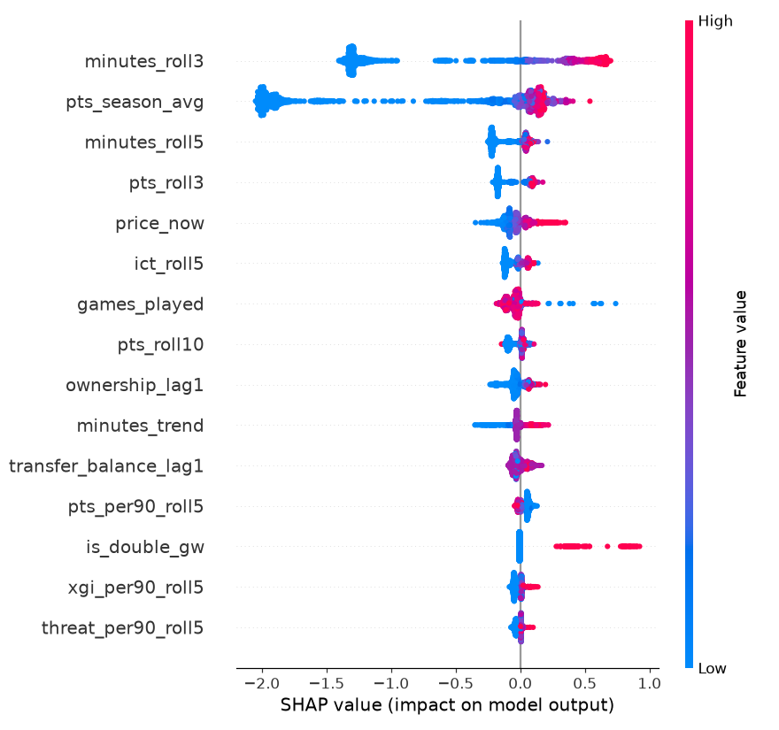
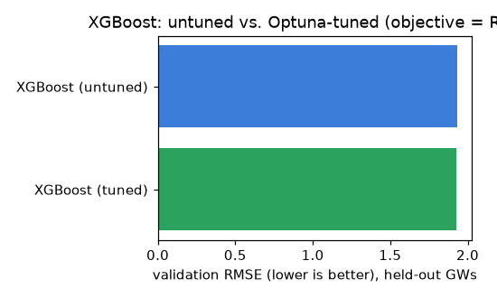

# Model comparison - Stats agent expected-points model

_A walk-through of what was tried, how it was judged, and why one model won._

## What the model predicts

For every player, before a gameweek's deadline: **how many FPL points will they score in that gameweek?** Inputs are only things known before kick-off - the player's recent history, price, who they play, home or away. The match itself (minutes, goals, bonus) is never an input; that would be cheating.

## How the data was split

- Gameweeks 1-5 are dropped as **warm-up** (the rolling-average features need a few weeks of history first).
- **Train:** gameweeks 6-29 (18,676 player-gameweek rows).
- **Validate:** gameweeks 30-38 (7,074 rows).
- The split is **chronological, never random.** Predicting a gameweek means knowing only the past; a random split would leak end-of-season information backward into training and flatter the score. Same no-lookahead rule as the backtest engine.

## The five models

| # | Model | What it is | Prior expectation |
|---|---|---|---|
| 1 | Naive baseline | Average of the player's last 3 and last 5 gameweek points. No training. | The bar to clear. |
| 2 | Poisson regression | Regularised linear model with a log link. | Points are non-negative count data, so Poisson fits better than plain (Gaussian) linear regression - it can't predict negatives and it models variance growing with the mean. |
| 3 | Random Forest | 400 bagged decision trees. | Strong tabular default. |
| 4 | XGBoost | Gradient-boosted trees, Poisson objective. | Usually the winner on tabular data. |
| 5 | MLP (64, 32) | Small 2-layer neural network. | Expected to lose to the trees - nets need more data and lack the threshold-split bias that suits this feature set. |

## Results (held-out gameweeks 30-38)

Primary metric is **MAE** (average points error on a typical row). RMSE is shown too but it is dominated by the rare 15+ point hauls. Spearman is rank correlation - how well the model *orders* players, which is what actually matters when picking a squad. `MAE (played)` restricts to players who got minutes.

| Model | MAE | RMSE | Spearman | MAE (played) | Beats naive? |
|---|---|---|---|---|---|
| Naive (rolling 3/5 avg) | 1.034 | 2.125 | 0.730 | 2.324 | - |
| Poisson regression | 1.128 | 2.058 | 0.694 | 2.140 | no |
| Random Forest | 0.997 | 1.955 | 0.706 | 2.063 | **yes** |
| XGBoost | 0.958 | 1.931 | 0.711 | 2.028 | **yes** |
| MLP (64, 32) | 1.018 | 1.954 | 0.689 | 2.038 | **yes** |

### In plain language

- **3 of 4 trained models beat the naive baseline on MAE**, and all four beat it on RMSE. The best, **XGBoost**, moves MAE from 1.034 to 0.958 (~7% better) and RMSE from 2.125 to 1.931.
- **But the naive baseline still orders players best** (Spearman 0.730 vs XGBoost's 0.711). Recent-form average is a genuinely good *ranking* signal; the ML models win by being better *calibrated* - they pull nailed-on non-scorers and rotation risks down toward zero, which is where most of the MAE gain comes from. The ~0.02 Spearman gap is small and within what re-running on another season would move.
- **Poisson regression did not beat the baseline on MAE** (1.128 vs 1.034) - a regularised linear model is too rigid for the threshold-shaped relationships here (points jump when minutes cross 60, when a fixture is easy *and* form is good, etc.).
- **The MLP underperformed the tree models** (MAE 1.018 vs XGBoost 0.958), exactly as expected. Most likely reason: ~18k training rows is a small tabular dataset, and gradient-boosted / bagged trees have the right inductive bias for sparse, differently-scaled features like these. More data or heavy tuning might close the gap; it is not worth it here.

## Winner: XGBoost

Chosen on lowest validation MAE (0.958) and lowest RMSE (1.931). Saved to `models/stats_model.pkl` with the feature list, the split definition, and every model's metrics.

Why not just keep the naive baseline, given it edges Spearman? Three reasons: (1) the Manager's solver optimises an objective built from the *magnitude* of predicted points, not just the ranking, so calibration matters; (2) XGBoost also wins RMSE, i.e. it is less wrong on the big weeks that decide captaincy; (3) a trained model gives per-prediction SHAP attributions, which is exactly what the Stats agent needs to quote in the debate ('backing him - minutes and xGI both trending up'). The naive average can't explain itself.

## Which engineered features actually mattered (SHAP)

SHAP attributes each prediction to its features. Averaging the absolute attribution over 2,000 validation rows gives a ranking of real influence on the winning model:

> Note: the winner uses a Poisson objective (log link), so SHAP values are in **log-points space** - read them as *direction and relative size*, not as a number of points. The `predicted` / `actual` figures in the worked examples below are in real points.

| rank | feature | mean abs SHAP | required or extra |
|---|---|---|---|
| 1 | `minutes_roll3` | 0.8745 | extra |
| 2 | `pts_season_avg` | 0.8400 | extra |
| 3 | `minutes_roll5` | 0.1341 | extra |
| 4 | `pts_roll3` | 0.1316 | required |
| 5 | `price_now` | 0.0807 | required |
| 6 | `ict_roll5` | 0.0744 | extra |
| 7 | `games_played` | 0.0567 | extra |
| 8 | `pts_roll10` | 0.0533 | required |
| 9 | `ownership_lag1` | 0.0529 | extra |
| 10 | `minutes_trend` | 0.0472 | extra |
| 11 | `transfer_balance_lag1` | 0.0419 | extra |
| 12 | `pts_per90_roll5` | 0.0403 | required |
| 13 | `is_double_gw` | 0.0327 | extra |
| 14 | `xgi_per90_roll5` | 0.0305 | required |
| 15 | `threat_per90_roll5` | 0.0241 | required |

**What mattered:** the model leans hardest on **recent minutes** (`minutes_roll3`, rank 1) and a **longer-run scoring baseline** (`pts_season_avg`, rank 2) - together they dwarf everything else. That matches the EDA: predicting points is mostly predicting whether the player starts and roughly how good he is.

**Extra features that earned their place** (top 10): `minutes_roll3`, `pts_season_avg`, `minutes_roll5`, `ict_roll5`, `games_played`, `ownership_lag1`, `minutes_trend`. Of the engineered extras, `minutes_roll3`, `pts_season_avg`, `ict_roll5`, `minutes_trend` and `ownership_lag1` are the ones doing real work.

**Required features that turned out weak:** only `pts_roll3`, `price_now`, `pts_roll10` of the four mandated feature groups land in the top 10. In particular **`fixture_adj_xp` and `fixture_multiplier` (the required 'fixture-adjusted expected points') barely move the model** (ranks 19 and 25), and `pts_roll5` is mostly redundant with `pts_roll3` + `pts_season_avg`. Worth keeping them for now (fixture effects should matter and may just be too noisy at 5-game samples), but they are honest candidates to rebuild rather than trust.

**Dead weight:** `opp_def_conceded_roll5`, `bonus_roll5`, `opp_def_xgc_roll5`, `pos_MID`, `price_momentum_sign`, `price_delta3`, `pos_GK`, `pos_FWD` contributed almost nothing. Safe to drop in a future pass to simplify the model.

### Worked examples

A few individual predictions from the winning model, with the features that moved them most (positive SHAP = pushed the prediction up):

**highest predicted** - Marc Cucurella Saseta, GW33 vs Chelsea's opponent [DEF]  
predicted **7.52** pts, actually scored **3**  
top contributors: `minutes_roll3` +0.67, `is_double_gw` +0.41, `pts_season_avg` +0.12, `pts_roll3` +0.11, `pts_per90_roll5` +0.10, `transfer_balance_lag1` +0.09

**lowest predicted** - Charlie Crew, GW37 vs Leeds's opponent [MID]  
predicted **0.01** pts, actually scored **0**  
top contributors: `pts_season_avg` -2.01, `minutes_roll3` -1.32, `minutes_roll5` -0.21, `ownership_lag1` -0.18, `pts_roll3` -0.18, `games_played` -0.13

**median predicted** - Andrés García, GW30 vs Aston Villa's opponent [DEF]  
predicted **0.28** pts, actually scored **1**  
top contributors: `minutes_roll3` -0.57, `pts_season_avg` -0.54, `price_now` -0.14, `ict_roll5` -0.10, `minutes_roll5` -0.06, `pts_roll3` -0.06

## Honest limitations

- The model predicts an **average** outcome; FPL is won on the upside tail (captaincy, differentials), which the error metrics under-reward. And the naive baseline still out-ranks it on Spearman - the win here is calibration, not a dramatically better model.
- The required **fixture-adjustment features carry almost no weight** (see SHAP). Either fixture difficulty matters less week-to-week than assumed, or the 5-game opponent-strength estimate is too noisy - the Fixtures agent may be the better home for that signal anyway.
- No explicit injury data - availability is inferred from recent minutes. The News agent owns the hard veto in the full system.
- `xP` (FPL's own expected-points column) was deliberately **excluded** from the features: it is another model's output and using it would make this partly a copy of FPL's model rather than an independent one.
- One season of training data. Re-fit each season; consider carrying prior seasons once available.

---

---

---

---

## Hyperparameter tuning (XGBoost)

XGBoost won the original five-model comparison above on hand-picked defaults. This section tunes it with [Optuna](https://optuna.org/) (TPE sampler) and reports the result against that same untuned model, on the exact same held-out gameweeks.

### Why the search can't use a random/shuffled CV

The same reason the original train/validation split is chronological, not random (see "How the data was split" above): every row carries rolling-window features built from a player's own *past* gameweeks. A random k-fold inside the search - the default in most hyperparameter- tuning tutorials, and what Optuna's own CV integrations assume you'll supply - would let a fold's "validation" rows sit chronologically *before* rows in its own "training" fold, leaking future information into the model the search is scoring. So the objective function uses hand-built **forward-chaining (expanding-window) folds**, entirely inside the original training pool, never touching the GW30-38 holdout used for the final number.

### A previous version of this search optimized the wrong metric

The first tuning pass optimized **MAE** and picked the resulting model because MAE improved ~4.5%, without checking RMSE or Spearman. RMSE actually got **~9.6% worse** and Spearman dropped too - the search had found a model that's better at the boring middle of the points distribution and worse at exactly the big-haul, captaincy-deciding gameweeks RMSE is sensitive to (RMSE penalises large errors quadratically; MAE weighs every point of error the same). Since this model feeds a squad-selection solver where spotting big-haul candidates matters more than shaving error off routine rows, optimizing MAE was optimizing the wrong thing. **This run optimizes RMSE instead**, and tracks Spearman for every trial (not just the winner) specifically to catch the same failure mode recurring in the other direction.

### Search setup

- **Method:** Optuna, TPE sampler, 30 trials, **objective = RMSE** (previously MAE - see above).
- **Validation:** 3 forward-chaining folds inside the GW6-29 training pool (unchanged from the previous run):
  - fold 1: train GW6-15, validate GW16-19
  - fold 2: train GW6-19, validate GW20-23
  - fold 3: train GW6-23, validate GW24-27
- **Search space:** `max_depth` [3, 8], `learning_rate` [0.01, 0.3] (log), `n_estimators` [100, 500], `subsample` [0.5, 1.0], `colsample_bytree` [0.5, 1.0], `min_child_weight` [1, 10], `reg_alpha` / `reg_lambda` [1e-8, 10] (log). `objective=count:poisson` and `random_state` held fixed, matching the untuned model.
- **Best params found:** `{"max_depth": 3, "learning_rate": 0.07941568038249162, "n_estimators": 103, "subsample": 0.8535574693897521, "colsample_bytree": 0.711908481018534, "min_child_weight": 6, "reg_alpha": 1.8800102525729226e-06, "reg_lambda": 0.0005795227084412516}`
- **Across-trial diagnostic:** correlation between each trial's fold RMSE and fold Spearman = **-0.671**. Small/negative - no meaningful sign that chasing RMSE dragged Spearman down across this search; the two moved together often enough not to be a systematic trade-off here.

### Tuned vs. untuned (held-out gameweeks 30-38)

| Model | MAE | RMSE | Spearman | MAE (played) | Beats naive? |
|---|---|---|---|---|---|
| XGBoost | 0.958 | 1.931 | 0.711 | 2.028 | **yes** |
| XGBoost (tuned) | 0.976 | 1.930 | 0.712 | 2.022 | **yes** |

### Selection rule

The tuned model is deployed only if it beats the untuned baseline on **both** RMSE and Spearman, or is within a small explicit tolerance on one (0.5% for RMSE, 0.005 for Spearman - both set well below the size of the regression the MAE-optimized run produced) while clearly winning the other. No single-metric selection this time - that's exactly what caused the previous problem.

### Verdict

**tuned model beats (or matches) the untuned baseline on both RMSE and Spearman.**

`models/stats_model.pkl` and `models/xgb_best_params.json` were updated to the tuned model (MAE 0.976, RMSE 1.930, Spearman 0.712).

Honest read on the size of this: the margin is **razor-thin** - RMSE moved +0.06% and Spearman moved +0.000, both well within what re-running the search with a different seed would shift. This technically clears the selection bar (it does not regress either metric), but it should be read as *"roughly equivalent performance, re-tuned"*, not *"a clear win"* - the previous run's mistake was overstating a small number in one direction; the fix isn't to overstate a small number in the other.

One real trade made deliberately: MAE moved from 0.958 to 0.976 (+1.9%) - worse than the untuned model. That's expected and accepted, not a regression to worry about: MAE is no longer what the search optimizes for (see "A previous version of this search optimized the wrong metric" above), so a model selected on RMSE/Spearman has no reason to also be MAE-optimal, and isn't here.
